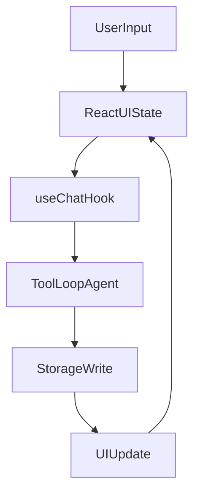
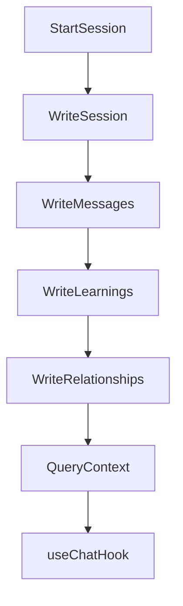

# Intelligent Planning Layer: Opening State Design

> **Status:** Initial prototype complete  
> **Last Updated:** 2026-02-01

## The Idea

An intelligent planning layer that acts as an abstraction over Claude Code, enhancing the initial "What are you building?" phase with interactive brainstorming, codebase awareness, and research integration. Each planning cycle compounds knowledge, making future development easier.

## Problem

- Current planning is a blank text box—no guidance, no context
- No memory of previous decisions or learnings
- No awareness of codebase structure or patterns
- Research happens separately from planning
- 80% of compound engineering is in planning and review, but the UI doesn't help

## Proposed Solution

### Opening State Flow

```
Question → Scanning → Narrative → Brainstorm → Handoff
```

1. **Opening Question** - Conversational prompt with hybrid inputs
2. **Scanning Animation** - Progressive codebase analysis
3. **Narrative Summary** - AI understanding with confirm/correct
4. **Brainstorm** - Ping-pong dialogue with adaptive rhythm
5. **Handoff** - Prepare context for `/workflows:plan`

### UX flows (draft)

**Opening question**
- Entry: short prompt, five intent buttons, free text field.
- Primary action: Continue to scan with selected intent + text.
- Secondary: “Skip scanning” (if no repo) and “Resume last session”.
- State: show example prompt chips for first-time users.

**Scanning**
- Entry: show current step, file count, and active task.
- Controls: Back, Cancel scan, “View files” drawer.
- Completion: transition to Narrative with brief “what I found” line.
- Error: show retry, or jump to “Just exploring” mode.

**Narrative summary**
- Entry: 3–5 bullets summarising structure and risks.
- Actions: Confirm, Correct, or “Add detail”.
- Correction: opens inline edit, preserves original for reference.
- Progress: subtle dots remain visible for orientation.

**Brainstorm**
- Entry: first AI question seeded by intent + narrative.
- Input: single-line send, ⌘/Ctrl+Enter for newline, Stop while streaming.
- Controls: Try again, Back to planning, Save as draft.
- Rhythm: short prompts first, deeper follow-ups after confirmation.

**Handoff**
- Entry: context preview (decisions, scope, files touched).
- Actions: Start `/workflows:plan`, Export summary, or Return to Brainstorm.
- Result: create a plan-ready payload with traceable sources.

**Global flows**
- Resume: restore step, draft, and scroll position.
- Errors: show inline message with clear recovery action.
- Keyboard: focus stays in input; Escape closes drawers.

### Wireframes (draft)

**Opening question**
```
------------------------------------------------------------
What are you building?
[Build a feature] [Fix something] [Continue previous]
[Just exploring] [I'm lost]

Describe what you want to achieve
[__________________________________________]
Examples: "Add billing", "Fix login timeout"

[Continue]                         [Resume last session]
------------------------------------------------------------
```

**Scanning**
```
------------------------------------------------------------
Scanning your codebase
Step 2 of 5 • 124 files • 00:08
Current task: reading src/App.jsx

[View files]                               [Cancel scan]
------------------------------------------------------------
```

**Narrative summary**
```
------------------------------------------------------------
Here is what I found
- React app with opening state flow
- Uses AI SDK useChat for brainstorming
- No persistence layer wired yet

[Confirm]  [Correct]  [Add detail]
------------------------------------------------------------
```

**Brainstorm**
```
------------------------------------------------------------
Let's clarify the goal
Assistant: What should the first outcome be?

Your reply
[__________________________________________]

[Send]  [Try again]  [Back to planning]  [Save draft]
------------------------------------------------------------
```

**Handoff**
```
------------------------------------------------------------
Plan handoff
Decisions: 3 • Files referenced: 6 • Risks: 1

[Start /workflows:plan]  [Export summary]  [Back]
------------------------------------------------------------
```

### Core Features

| Feature | Description |
|---------|-------------|
| **Hybrid Inputs** | Choice buttons + freeform text + confirmation prompts |
| **Codebase Awareness** | Structure, patterns, history, recent activity |
| **Research Modes** | Early, Mid-flow, On-demand, Continuous |
| **Session Persistence** | Resume exactly where you left off |
| **Relationship Graph** | Code-Code, Code-Decision, Decision-Prior Art, Intent-Implementation |

### User Intent Categories

Five entry points based on user state:
- Build a feature — icon: lucide:rocket
- Fix something — icon: lucide:wrench
- Continue previous — icon: lucide:undo
- Just exploring — icon: lucide:search
- I'm lost — icon: lucide:compass

### Design Decisions

| Decision | Choice | Rationale |
|----------|--------|-----------|
| Tone | Thoughtful mentor | Guides without being prescriptive |
| Error handling | Transparent + retry | Users see what went wrong |
| Learning feedback | Automatic | Captures without interrupting flow |
| Memory scope | Project-scoped | Focused context, no cross-project confusion |
| Brainstorm rhythm | Adaptive | Short at first, deepens as needed |
| Progress indicator | Subtle dots | Shows state without distraction |
| App comms | Cash App tone rules | Apply `docs/specs/tone-of-voice.md` in all user-facing copy |

## Implementation Phases

### Phase 1: Opening State ✅
- [x] Opening question with hybrid inputs
- [x] Scanning animation with progress
- [x] Narrative summary with confirm/correct
- [x] Brainstorm placeholder
- [x] Back button and state management
- Behaviour: progresses linearly with clear state labels and recovery
- Success signal: user reaches Brainstorm placeholder in under 60s

### Phase 2: Brainstorm Dialogue ✅
- [x] Ping-pong conversation flow
- [x] Adaptive question depth
- [x] Ambiguity handling ("It sounds like X. Is that right?")
- [x] Multi-intent sequencing
- [x] **"Try again" button** using `regenerate()` from useChat
- [x] **"Back to planning" escape hatch** - available in any phase
- Behaviour: short prompts first, deeper follow-ups after confirmation
- Success signal: 3+ back-and-forth turns without manual reset

### Phase 3: Session & Memory ← next
> *Foundational — all subsequent phases depend on persistence*
- [ ] Session persistence (resume exactly)
- [ ] Relationship graph storage
- [ ] Automatic learning capture
- [ ] **Semantic embeddings** with nomic-embed-text
- [ ] **Vector retrieval** in prepareStep
- Behaviour: resume restores step, draft, and scroll position
- Success signal: resume matches last state after app restart
- **Why first:** `onFinish` needs somewhere to write. `prepareStep` needs something to query. Research results need storage. Everything upstream requires a persistence layer.

### Phase 4: AI SDK Hooks (Boris Tips)
> *Depends on Phase 3 — hooks write to and read from storage*
> *Based on tips from Claude Code creator Boris Cherny*

| Boris Tip | AI SDK Implementation |
|-----------|----------------------|
| "Claude writes rules for itself" | `onFinish` → auto-update `agents.md` |
| "Back to plan mode" | Custom `stopWhen` condition |
| Skills for repeated tasks | `prepareStep` → inject relevant skills |
| "Try again, you can do better" | `regenerate()` function |
| Regular cleanups | `/float cleanup` command → agent tool |
| Parallel worktrees | Multiple agent sessions |

**Implementation Details:**

```typescript
// useChat with compound hooks
const { messages, regenerate, stop, status } = useChat({
  onFinish: async ({ message, messages }) => {
    // Auto-extract learnings and update agents.md
    await extractLearnings(messages);
    await updateAgentsMd(message);
    await persistToFloatDb(messages);
  },
  onData: (data) => {
    // Micro-session logging between major efforts
    logMicroSession(data);
  },
  onError: (error) => {
    // Surface error, offer "back to planning"
    suggestBackToPlan(error);
  },
});

// Agent with compound context injection
const planningAgent = new ToolLoopAgent({
  model: "anthropic/claude-sonnet-4.5",
  tools: { scanCodebase, searchWeb, updateAgentsMd },

  prepareStep: async ({ stepNumber, messages }) => {
    // Inject relevant context from float.db before each step
    const learnings = await querySemanticMemory(messages);
    const skills = await getRelevantSkills(messages);

    return {
      system: `${basePrompt}\n\n${learnings}\n\n${skills}`,
    };
  },

  stopWhen: [
    stepCountIs(20),
    // Custom: stop if user wants to re-plan
    ({ steps }) => steps.some(s => s.text?.includes('[BACK_TO_PLAN]')),
  ],
});
```

- [ ] Implement `onFinish` hook for auto-learning extraction
- [ ] Implement `prepareStep` for dynamic context injection
- [ ] Create custom `stopWhen` for planning escape hatch
- [ ] Build `/float cleanup` agent tool
- [ ] Add `regenerate()` "retry" button to UI
- Behaviour: hooks run silently and only surface on errors
- Success signal: learnings append without user interruption

### Phase 5: Research Integration
> *Depends on Phases 3+4 — research results stored and injected via hooks*
- [ ] Research mode toggle (4 modes)
- [ ] Surface, Synthesized, Deep dive levels
- [ ] Inline cards, expandable details, digests
- Behaviour: research cards appear inline with opt-in expansion
- Success signal: user can complete a plan without leaving UI

### Phase 6: Intent Layer
> *Depends on Phases 3+4+5 — auto-updating intent nodes needs storage, hooks, and research*
- [ ] `agents.md` as root Intent Node
- [ ] Downlinks to subsystem docs
- [ ] Auto-compression of learnings
- [ ] **Maintenance flywheel** - agents update nodes
- Behaviour: intent nodes are updated after each planning session
- Success signal: intent docs evolve without manual edits

### Phase 7: Handoff Enrichment
> *Handoff UI already exists (Phase 2). This enriches it with research + persistence data.*
- [ ] Include research results in handoff payload
- [ ] Include relationship graph in handoff
- [ ] Resume handoff from persisted session
- Behaviour: one-click export to plan workflow with full context
- Success signal: plan workflow starts with zero re-asking

### Phase 8: Cloud Backend (Future)
> *Perfect local experience first, then add cloud for sync/teams*
- [ ] Next.js API routes on Vercel
- [ ] Cloud database (Postgres) for session sync
- [ ] Multi-device access
- [ ] Team collaboration features
- [ ] Usage billing / API key management
- Behaviour: local-first with optional sign-in upgrade path
- Success signal: sync works without breaking offline mode

## Technical Architecture

### Technology Stack

```
┌─────────────────────────────────────────────────────────────┐
│                      Tauri Desktop App                       │
│  ┌───────────────────────────────────────────────────────┐  │
│  │                    React Frontend                      │  │
│  │  Next.js (SSG) + AI SDK + Wise Design System          │  │
│  │                                                        │  │
│  │  ┌─────────────┐   ┌─────────────┐   ┌─────────────┐  │  │
│  │  │   useChat   │   │ Components  │   │   State     │  │  │
│  │  │   hook      │   │   (Wise)    │   │  (Zustand)  │  │  │
│  │  └─────────────┘   └─────────────┘   └─────────────┘  │  │
│  └────────────────────────┬──────────────────────────────┘  │
│                           │                                  │
│  ┌────────────────────────▼──────────────────────────────┐  │
│  │                    Rust Backend                        │  │
│  │  ┌─────────────┐   ┌─────────────┐   ┌─────────────┐  │  │
│  │  │   SQLite    │   │  File Ops   │   │    IPC      │  │  │
│  │  │   Plugin    │   │  (Codebase) │   │   Bridge    │  │  │
│  │  └─────────────┘   └─────────────┘   └─────────────┘  │  │
│  └───────────────────────────────────────────────────────┘  │
└─────────────────────────────────────────────────────────────┘
                           │
                           ▼
              ┌─────────────────────────┐
              │   Anthropic Claude API   │
              │   (via AI SDK)           │
              └─────────────────────────┘
```

### Runtime flow (high level)



- File ops and IPC happen in the Tauri Rust backend, then return results to the frontend.
- UI state and chat state remain in the React layer; storage persists only via backend calls.

### Component Details

| Layer | Technology | Purpose | Research |
|-------|------------|---------|----------|
| Desktop | **Tauri** | Lightweight wrapper (30-40 MB) | [desktop-architecture.md](docs/research/desktop-architecture.md) |
| Frontend | **Next.js + SSG** | React with static export | - |
| AI | **Vercel AI SDK** | useChat, ToolLoopAgent | [ai-sdk-integration.md](docs/research/ai-sdk-integration.md) |
| Storage | **SQLite** | Sessions, messages, relationships | [conversation-persistence.md](docs/research/conversation-persistence.md) |
| Styling | **Wise Design System** | Design tokens, components | - |

### Installation

```bash
# Core dependencies
npm install ai @ai-sdk/react @ai-sdk/anthropic

# Tauri (init separately)
npm create tauri-app@latest

# SQLite plugin for Tauri
cargo add tauri-plugin-sql
```

### AI SDK Integration

Based on research ([full analysis](docs/research/ai-sdk-integration.md)), the Vercel AI SDK provides:

| AI SDK Component | Our Feature |
|------------------|-------------|
| `useChat` hook | Brainstorm dialogue with streaming |
| `ToolLoopAgent` | Codebase scanning + research agent |
| Tool approval flow | User confirmations |
| `DirectChatTransport` | Direct agent communication |

**Flow overview:**
- User prompt enters `useChat`, streams messages to UI
- `onData` logs micro-sessions during the stream
- `onFinish` extracts learnings and persists context
- `regenerate()` replays the last turn for "Try again"

**Responsibilities:**
- `useChat`: stream state, retry, status, and UI-safe errors
- `ToolLoopAgent`: tool calls, step limits, stop conditions
- UI: display, confirm/correct, and routing to "back to planning"

**AI SDK boilerplate references:**
- `useChat` UI basics: https://github.com/vercel/ai/blob/main/content/docs/04-ai-sdk-ui/02-chatbot.mdx — baseline chat UI shape
- `regenerate()` usage: https://github.com/vercel/ai/blob/main/content/docs/07-reference/02-ai-sdk-ui/01-use-chat.mdx — retry semantics for "Try again"
- Streaming route handler (`streamText`): https://ai-sdk.dev/cookbook/next/stream-text — minimal server streaming boilerplate
- Chat API route examples: https://ai-sdk.dev/cookbook/guides/multi-modal-chatbot — full client + route wiring
- UI status + stop patterns: https://github.com/vercel/ai/blob/main/content/docs/04-ai-sdk-ui/02-chatbot.mdx — loading/stop UI rules
- Shared chat input pattern: https://github.com/vercel/ai/blob/main/content/cookbook/01-next/74-use-shared-chat-context.mdx — decouple input from message list
- Agent loop stop conditions: https://github.com/vercel/ai/blob/main/content/docs/03-agents/04-loop-control.mdx — stopping rules for tool loops
- Step limits with `stopWhen`: https://github.com/vercel/ai/blob/main/content/docs/03-agents/02-building-agents.mdx — cap agent steps
- Message persistence guide: https://github.com/vercel/ai/blob/main/content/docs/04-ai-sdk-ui/03-chatbot-message-persistence.mdx — save/load flow
- Testing with mocks: https://github.com/vercel/ai/blob/main/content/docs/03-ai-sdk-core/55-testing.mdx — deterministic AI tests

### Agent-native patterns (design)

- Event-driven turns: define triggers (user message, scan complete, retry) and persist state between turns.
- Agent → UI sync: use one of shared store, file watch, or event bus so UI updates immediately.
- Approval gates: separate propose vs apply for risky actions (deps, prompt changes).
- Unified orchestrator: one engine, multiple agent configs (planning, research, chat).
- Model tiers: pick fast/balanced/powerful per agent type and cost profile.

**Design questions:**
- What events trigger agent turns?
- Which primitives are required for parity with UI?
- What decisions are agent judgement vs hardcoded?
- How does the agent verify outcomes?
- How does the UI observe agent changes?
- What model tier is used per agent type?

### Storage Schema

See [conversation-persistence.md](docs/research/conversation-persistence.md) for full schema:

```sql
CREATE TABLE sessions (id, project_path, title, created_at, last_message_at);
CREATE TABLE messages (id, session_id, role, content, created_at, metadata);
CREATE TABLE relationships (id, session_id, type, source_path, target_path, label);
CREATE TABLE learnings (id, session_id, category, content, related_files);
```

**Persistence flow:**


- Sessions and messages write on each turn; learnings and relationships write on `onFinish`.
- Retrieval happens before each step to enrich prompts and UI summaries.

## Resolved Questions

| Question | Decision | Rationale |
|----------|----------|-----------|
| Relationship graph storage | **SQLite** | Local, reliable, supports embeddings via sqlite-vec |
| Deployment model | **Tauri desktop** | Lightweight, cross-platform, native file access |
| Framework | **Next.js → Tauri** | Migrate from Vite; SSG for Tauri compatibility |

## Open Questions

1. How will multi-project support work? (monorepos)
2. Should we support VS Code extension as secondary target?

## Acceptance Criteria

- [x] Opening question renders with 5 intent buttons
- [x] Scanning animation shows progressive status
- [x] Narrative summary displays codebase understanding
- [x] Confirm/correct options work as expected
- [x] Back button navigates through states
- [x] No crashes or race conditions
- [ ] Complete brainstorm flow with dialogue
- [ ] Research integration functional
- [ ] Session persistence across sessions
- [ ] Tauri desktop app builds successfully
- [ ] SQLite persistence working

## Compound engineering loop

### Context
- Problem: planning starts from a blank box with low guidance.
- Goal: shorten time to a clear plan with retained context.

### Research findings
- Related docs: `docs/research/ai-sdk-integration.md`, `docs/research/conversation-persistence.md`
- Core plan file: `plans/intelligent-planning-layer.md`

### Acceptance criteria (next loop)
- [ ] Brainstorm flow supports stop, retry, and back to planning
- [ ] Message persistence saves and restores a session
- [ ] Handoff builds a plan-ready payload with sources

### Technical approach (next loop)
1. Implement Brainstorm dialogue with `useChat` controls
2. Add persistence hooks (`onFinish`) and restore on load
3. Generate handoff summary and payload for `/workflows:plan`

### Testing strategy (next loop)
- Manual: full flow from Question → Handoff
- Manual: resume from a saved session
- Manual: error path + retry in Brainstorm

### Risks and mitigations
- Risk: persistence drift between UI and storage → mitigate with single source of truth
- Risk: long prompts increase latency → mitigate with summarised context

### Compounding notes
- Update `docs/specs/tone-of-voice.md` when copy patterns emerge
- Record new UI/agent patterns in `AGENTS.md`

## Related Files

- `src/App.jsx` - Main React component with Opening State
- `agents.md` - Wise Design System rules
- `docs/research/` - Architecture research documents
- `plans/` - Compound engineering plans
